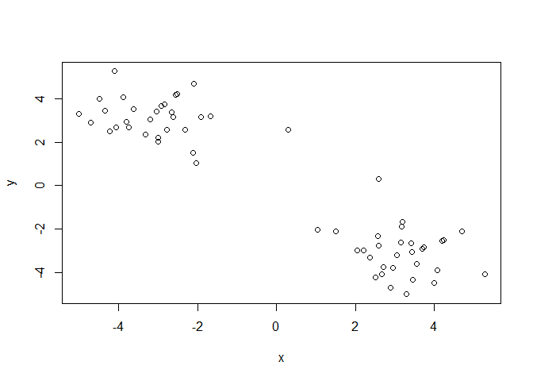
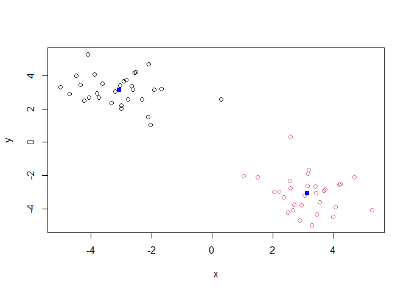
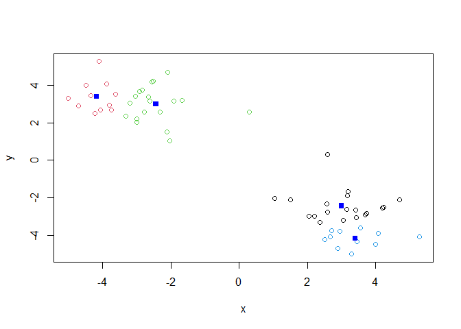
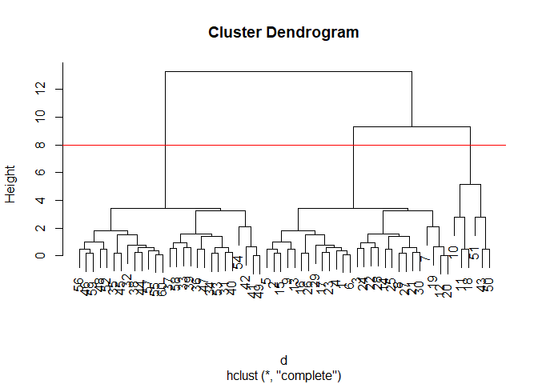
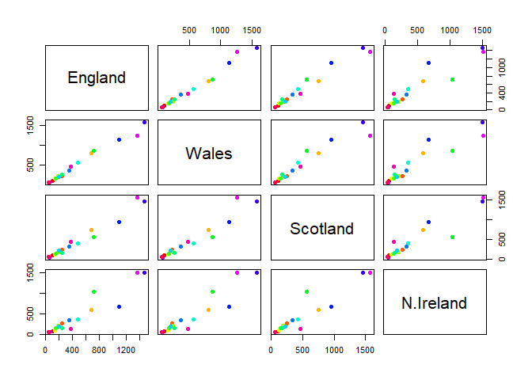
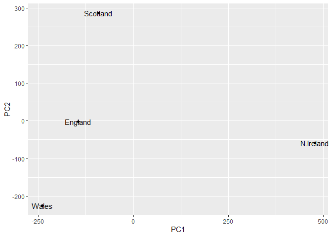
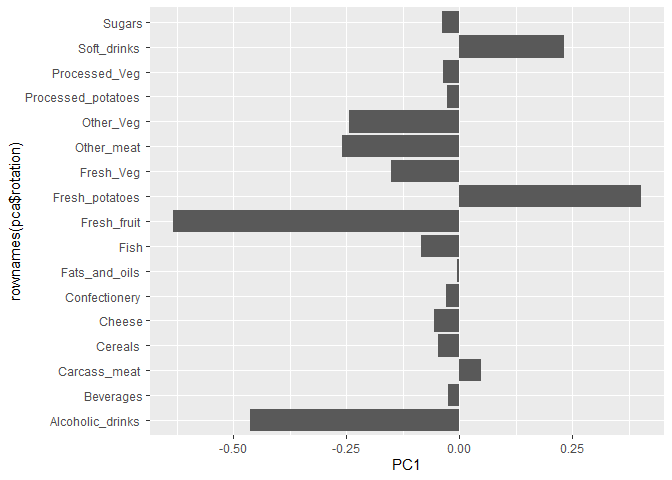

# Machine Learning 1
Muhammad Tariq

- [First up kmean()](#first-up-kmean)
- [Add more clusters to the plots](#add-more-clusters-to-the-plots)
  - [Hierarchical Clustering](#hierarchical-clustering)
  - [Principal Component Analysis
    (PCA)](#principal-component-analysis-pca)
    - [PCA TO THE RESUE](#pca-to-the-resue)
    - [Interpretting PCA results](#interpretting-pca-results)

Today we explore the use of different data presentation tools on R like
PCA

# First up kmean()

Demo of using kmean() function in base R. First make some data with a
known structure.

``` r
tmp <- c( rnorm(30,-3), rnorm(30,3))
x <- cbind(x=tmp, y=rev(tmp))
plot(x)
```



Now we have some made up data in ‘x’ lets see how kmeans() works with
this data

``` r
k <- kmeans(x,centers = 2, nstart = 20)
k
```

    K-means clustering with 2 clusters of sizes 30, 30

    Cluster means:
              x         y
    1 -3.080974  3.143687
    2  3.143687 -3.080974

    Clustering vector:
     [1] 1 1 1 1 1 1 1 1 1 1 1 1 1 1 1 1 1 1 1 1 1 1 1 1 1 1 1 1 1 1 2 2 2 2 2 2 2 2
    [39] 2 2 2 2 2 2 2 2 2 2 2 2 2 2 2 2 2 2 2 2 2 2

    Within cluster sum of squares by cluster:
    [1] 58.34239 58.34239
     (between_SS / total_SS =  90.9 %)

    Available components:

    [1] "cluster"      "centers"      "totss"        "withinss"     "tot.withinss"
    [6] "betweenss"    "size"         "iter"         "ifault"      

``` r
plot(x, col=k$cluster)
points(k$centers,col="blue",pch=15)
```



# Add more clusters to the plots

``` r
k <- kmeans(x,centers = 4, nstart = 20)
plot(x, col=k$cluster)
points(k$centers,col="blue",pch=15)
```



> **key-point**; K-means clustering is supper popular but can be
> miss-used. one big limitation is that it can impose a cliustyering
> pattern on your data even if clear natural grouping dont exist- i.e it
> does what you tell it to do in therms of ‘center’.

### Hierarchical Clustering

the main function in “base” R for hierarchical clustering is called
‘hclust’.

You can just pass our dataset as is into ‘hclust()’ you must give
“distance matrix” as input. We can get this from the ‘dist()’ function
in R.

``` r
d <- dist(x)
hc <- hclust(d)
hc
```


    Call:
    hclust(d = d)

    Cluster method   : complete 
    Distance         : euclidean 
    Number of objects: 60 

The results of ‘hclust)’ dont have a useful ‘print()” method but do have
a speacial ’plot()’ method.

``` r
plot(hc)
abline(h=8, col="red")
```



To get our main cluster assignmnet (membership vector) we need to “cut”
the tree at the big goal posts

``` r
grps <- cutree(hc, h=8)
grps
```

     [1] 1 1 1 1 1 1 1 1 1 2 2 1 1 1 1 1 1 2 1 1 1 1 1 1 1 1 1 1 1 1 3 3 3 3 3 3 3 3
    [39] 3 3 3 3 2 3 3 3 3 3 3 2 2 3 3 3 3 3 3 3 3 3

``` r
table(grps)
```

    grps
     1  2  3 
    27  6 27 

``` r
plot(x)
```


Hierarchical clustering is distinct in that the dendrogram (tree figure)
can reveal the potential grouping in your data (unlike K-means)

## Principal Component Analysis (PCA)

PCA is a common and highly useful dimensionality reduction technique
used in many fields - particularly bioinformatics.

Here we eill analyze some data from UK on food consumption.

\###data import

``` r
url <- "https://tinyurl.com/UK-foods"
x <- read.csv(url)

head(x)
```

                   X England Wales Scotland N.Ireland
    1         Cheese     105   103      103        66
    2  Carcass_meat      245   227      242       267
    3    Other_meat      685   803      750       586
    4           Fish     147   160      122        93
    5 Fats_and_oils      193   235      184       209
    6         Sugars     156   175      147       139

``` r
rownames(x)<- x[,1]
x <- x[,-1]
head(x)
```

                   England Wales Scotland N.Ireland
    Cheese             105   103      103        66
    Carcass_meat       245   227      242       267
    Other_meat         685   803      750       586
    Fish               147   160      122        93
    Fats_and_oils      193   235      184       209
    Sugars             156   175      147       139

``` r
x <- read.csv(url, row.names=1)
head(x)
```

                   England Wales Scotland N.Ireland
    Cheese             105   103      103        66
    Carcass_meat       245   227      242       267
    Other_meat         685   803      750       586
    Fish               147   160      122        93
    Fats_and_oils      193   235      184       209
    Sugars             156   175      147       139

``` r
barplot(as.matrix(x), beside=T, col=rainbow(nrow(x)))
```


one conventional plot that can be useful is called a “paris” plot.

``` r
pairs(x, col=rainbow(nrow(x)), pch=16)
```



### PCA TO THE RESUE

The main function in base R for PCA is called ‘prcomp()’

``` r
pca <- prcomp(t(x))
summary(pca)
```

    Importance of components:
                                PC1      PC2      PC3       PC4
    Standard deviation     324.1502 212.7478 73.87622 3.176e-14
    Proportion of Variance   0.6744   0.2905  0.03503 0.000e+00
    Cumulative Proportion    0.6744   0.9650  1.00000 1.000e+00

### Interpretting PCA results

The ’prcomp() function returns a list object of our results with five
attributes/components

``` r
attributes(pca)
```

    $names
    [1] "sdev"     "rotation" "center"   "scale"    "x"       

    $class
    [1] "prcomp"

The two main “results” in here are ‘pca$x' and 'pca$rotation’. the first
of these (pca\$x’) contains he scores of the data on the new PC axis -
we use these to make our “PCA plot”.

``` r
pca$x
```

                     PC1         PC2        PC3           PC4
    England   -144.99315   -2.532999 105.768945 -4.894696e-14
    Wales     -240.52915 -224.646925 -56.475555  5.700024e-13
    Scotland   -91.86934  286.081786 -44.415495 -7.460785e-13
    N.Ireland  477.39164  -58.901862  -4.877895  2.321303e-13

``` r
library(ggplot2)

#Make a plot of pca$x with PC1 vs PC2
ggplot(pca$x) + 
  aes(PC1, PC2, label=rownames(pca$x)) +
  geom_point() +
  geom_text()
```



! PC1 enlightens the differnces in the rows, in how different the foods
are consumed.

The second major result is contained in the ‘pca\$rotation’ object or
component. Let’s plot this to see what PCA is picking up…

``` r
ggplot(pca$rotation) +
  aes(PC1, rownames(pca$rotation)) +
  geom_col()
```



!it shows how which food is eaten so differently.
