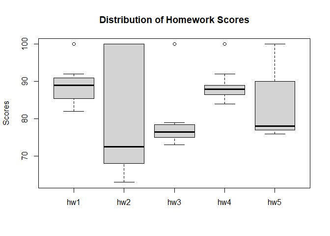

# Week 5: R Functions & Gradebook Analysis
Muhammad Tariq
2025-04-24

## Q1. Define `grade()` Function

``` r
# Example input vectors
student1 <- c(100, 100, 100, 100, 100, 100, 100, 90)
student2 <- c(100, NA, 90, 90, 90, 90, 97, 80)
student3 <- c(90, NA, NA, NA, NA, NA, NA, NA)

# Define the function
#' Calculate average score for a vector of student scores dropping the lowest score.
#' Missing values will be treated as zero.
#'
#' @param x A numeric vector of homework scores
#' @returns Average score
#' @export
#' @examples
#' student <- c(100, NA, 90, 97)
#' grade(student)

grade <- function(x) {
  # Mask NA with zero
  x[is.na(x)] <- 0
  # Drop the lowest score
  mean(x[-which.min(x)])
}

# Test the function
grade(student1)
```

    [1] 100

``` r
grade(student2)
```

    [1] 91

``` r
grade(student3)
```

    [1] 12.85714

## Q2. Who is the Top Scoring Student?

``` r
url <- "https://tinyurl.com/gradeinput"
gradebook <- read.csv(url, row.names = 1)

# Apply grade function to each student
results <- apply(gradebook, 1, grade)
sorted_results <- sort(results, decreasing = TRUE)
sorted_results
```

    student-18  student-7  student-8 student-13  student-1 student-12 student-16 
         94.50      94.00      93.75      92.25      91.75      91.75      89.50 
     student-6  student-5 student-17  student-9 student-14 student-11  student-3 
         89.00      88.25      88.00      87.75      87.75      86.00      84.25 
     student-4 student-19 student-20  student-2 student-10 student-15 
         84.25      82.75      82.75      82.50      79.00      78.75 

``` r
# Identify the top student
which.max(results)
```

    student-18 
            18 

## Q3. Which Homework Was the Toughest?

``` r
# Calculate mean scores per homework
ave.scores <- apply(gradebook, 2, mean, na.rm = TRUE)
ave.scores
```

         hw1      hw2      hw3      hw4      hw5 
    89.00000 80.88889 80.80000 89.63158 83.42105 

``` r
which.min(ave.scores)
```

    hw3 
      3 

``` r
# Calculate median scores per homework
med.scores <- apply(gradebook, 2, median, na.rm = TRUE)
med.scores
```

     hw1  hw2  hw3  hw4  hw5 
    89.0 72.5 76.5 88.0 78.0 

``` r
which.min(med.scores)
```

    hw2 
      2 

``` r
# Visualize using boxplot
boxplot(gradebook, main = "Distribution of Homework Scores", ylab = "Scores")
```



## Q4. Optional: Most Predictive Homework

``` r
# Replace NA with 0 for correlation analysis
masked.gradebook <- gradebook
masked.gradebook[is.na(masked.gradebook)] <- 0

# Calculate correlation of each homework with final grades
apply(masked.gradebook, 2, cor, x = results)
```

          hw1       hw2       hw3       hw4       hw5 
    0.4250204 0.1767780 0.3042561 0.3810884 0.6325982 
